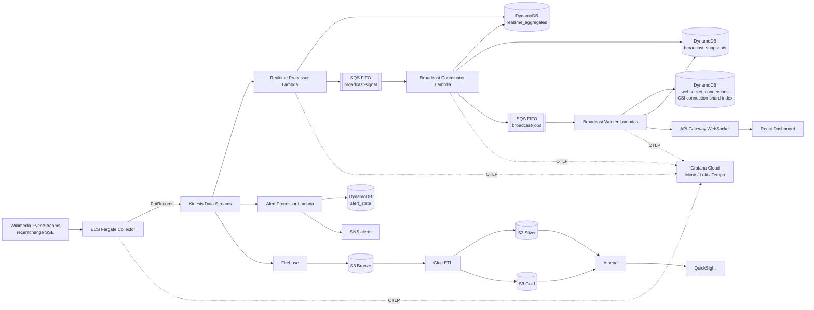

# Realtime Media Analytics Platform on AWS

Production-style, event-driven streaming analytics platform that consumes Wikimedia `recentchange` events, builds low-latency read models, pushes immutable snapshots to WebSocket clients, detects activity anomalies, and persists a Medallion Data Lake for historical analytics.

The active broadcasting implementation is **V2: Coordinator + sharded Workers + immutable snapshots + Latest State Wins**. The legacy single Broadcaster remains in the uploaded branch only as migration residue and is not connected to SQS.

## Validated status

The V2 fan-out path has been validated with a real k6 generator on EC2:

| Test | Result |
|---|---:|
| Concurrent WebSocket connections | 10,000 / 10,000 |
| Connection success | 100% |
| k6 connection errors | 0 |
| Hold duration | about 20 minutes |
| Frames received | about 2.54 million |
| Backend push freshness p95 | about 7 seconds |
| Connection shards | 10 |

The freshness result is a **backend push SLI**, not yet a browser-visible ground truth. See [`documentation/freshness-and-slo.md`](documentation/freshness-and-slo.md).

## Architecture at a glance



## Main runtime paths

### Real-time aggregation

```text
Wikimedia SSE
→ Collector normalization and deterministic sampling
→ Kinesis
→ Realtime Processor
→ DynamoDB atomic aggregate counters
```

### WebSocket broadcasting V2

```text
Realtime Processor
→ broadcast-signal.fifo
→ Coordinator
→ immutable topic snapshots + manifest + LATEST pointer
→ one FIFO job per connection shard
→ parallel Workers
→ API Gateway postToConnection
→ browser
```

### Alerting

```text
Kinesis
→ Alert Processor
→ minute counters and baselines in DynamoDB
→ z-score / moderation burst evaluation
→ deduplicated SNS alert
```

### Historical analytics

```text
Kinesis
→ Firehose
→ S3 Bronze JSONL GZIP
→ Glue Bronze-to-Silver Parquet
→ Glue Silver-to-Gold aggregates
→ Athena / QuickSight
```

## Architectural patterns

- Event-Driven Architecture
- publish/subscribe stream fan-out
- serverless-first compute with a long-running ECS collector
- Lambda Architecture-inspired speed and batch paths
- Medallion Data Lake: Bronze / Silver / Gold
- CQRS-inspired materialized read models
- DynamoDB write sharding and atomic `ADD`
- at-least-once stream/message processing
- immutable snapshots and manifests
- sharded WebSocket fan-out
- Latest State Wins delivery semantics
- bounded concurrency and explicit backpressure
- distributed tracing with W3C trace context
- customer-managed KMS encryption

## Current dev configuration

The values below are read from `terraform/environments/dev/terraform.tfvars` and the Lambda Terraform files.

| Component | Active configuration |
|---|---|
| Region | `us-east-1` |
| Collector | 1 Fargate task, 256 CPU units, 512 MiB |
| Sampling | 5% deterministic by `event_id` |
| Collector flush | 100 records or 1 second |
| Kinesis | provisioned, 1 shard, 48-hour retention |
| Realtime Processor | 1536 MiB, 60 s, batch 20 or 1 s |
| Aggregate window | 60 seconds |
| Broadcast coalescing window | 3 seconds |
| Coordinator | 512 MiB, 30 s |
| Connection shards | 10 |
| Worker | 1024 MiB, 30 s, reserved concurrency 20 |
| Worker network concurrency | 16 `postToConnection` calls per Worker |
| Worker HTTP pool | 24 connections per Lambda environment |
| API Gateway throttle | rate 5000, burst 2000 |
| Snapshot TTL | 900 seconds |
| WebSocket connection TTL | 7200 seconds |
| Firehose buffer | 64 MiB or 300 seconds |
| Stable WebSocket URL | `wss://stream-websocket.talelkarimchebbi.com` |
| Dashboard URL | `https://wiki.talelkarimchebbi.com` |

## Delivery semantics

The live dashboard is not an event-by-event guaranteed delivery system.

```text
Aggregates are authoritative in DynamoDB.
Snapshots represent recent materialized state.
Stale jobs are skipped.
Individual WebSocket delivery failures are retried locally, then abandoned.
A newer snapshot supersedes an older one.
The frontend rejects older sequence/window cursors.
```

This is appropriate for a live analytics dashboard. It would not be appropriate for a payment ledger or a workflow requiring every state transition.

## Source layout

```text
services/collector                     Long-running Wikimedia SSE producer
services/realtime-processor            Kinesis aggregation consumer
services/alert-processor               Kinesis anomaly detection consumer
services/broadcast-coordinator         Snapshot/manifest/job producer
services/broadcast-worker              Connection-shard fan-out consumer
services/websocket-*-handler            WebSocket lifecycle and subscriptions
frontend/dashboard                     React/Vite live dashboard
terraform/environments/dev             Active dev composition
terraform/modules                      Reusable AWS modules
load-tests                              k6 WebSocket load tests
documentation                           Architecture and operations documentation
```

## Build and deployment

Lambda packages are built into `.build/lambdas` and Terraform packages from that directory.

```bash
./scripts/build_all.sh
```

The infrastructure is applied through Terraform Cloud. Do not rely on local `terraform output` commands for this project.

The dashboard is built and deployed by GitHub Actions on pushes to branch `v2` that modify `frontend/dashboard/**`.

## Documentation index

| Document | Purpose |
|---|---|
| [`architecture.md`](documentation/architecture.md) | Complete system design, responsibilities and failure model |
| [`data-contracts.md`](documentation/data-contracts.md) | Every event, DynamoDB, SQS and WebSocket contract |
| [`sequence-diagrams.md`](documentation/sequence-diagrams.md) | End-to-end and failure-path Mermaid sequences |
| [`c4-diagrams.md`](documentation/c4-diagrams.md) | C4 context, container and component views |
| [`freshness-and-slo.md`](documentation/freshness-and-slo.md) | Exact freshness calculation, meaning and limitations |
| [`observability.md`](documentation/observability.md) | Metrics, logs, traces and Grafana topology |
| [`load-testing.md`](documentation/load-testing.md) | k6 strategy and validated test results |
| [`operations-runbook.md`](documentation/operations-runbook.md) | Deployment, verification and incident procedures |
| [`scaling-and-capacity.md`](documentation/scaling-and-capacity.md) | Capacity model and scaling boundaries |
| [`security.md`](documentation/security.md) | IAM, KMS, networking and secret handling |
| [`known-limitations.md`](documentation/known-limitations.md) | Honest production gaps and remediation order |
| [`historical-analytics.md`](documentation/historical-analytics.md) | Bronze/Silver/Gold, Glue, Athena and QuickSight |
| [`repository-map.md`](documentation/repository-map.md) | Source-to-resource map |
| [`v2-cleanup.md`](documentation/v2-cleanup.md) | Legacy V1 and migration residue to remove |
| [`adr/`](documentation/adr/) | Architectural Decision Records |

## Known high-priority gaps

1. validate freshness independently at k6/browser receive time;
2. make aggregate writes idempotent under partial DynamoDB success and Kinesis replay;
3. remove the legacy single Broadcaster and transitional subscription table;
4. enable and use Kinesis shard-level metrics before increasing shard count;
5. test 10,000 users with multiple topics and chunking;
6. document and test late-event/watermark behavior for alerting.

See [`documentation/known-limitations.md`](documentation/known-limitations.md) for the full critique.
