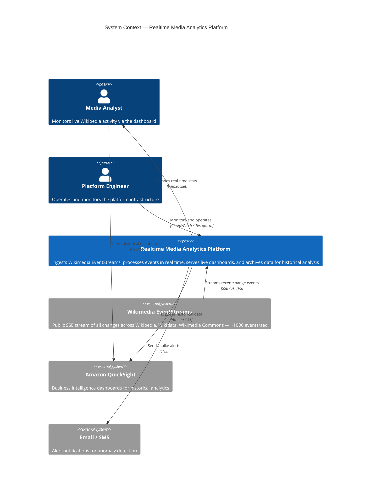
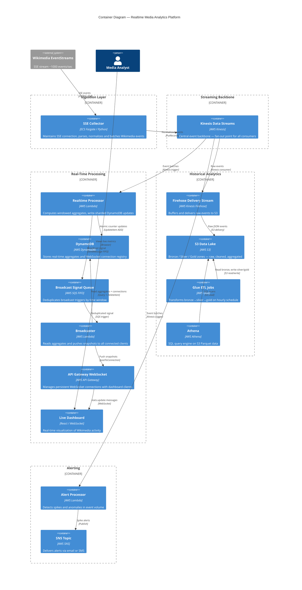
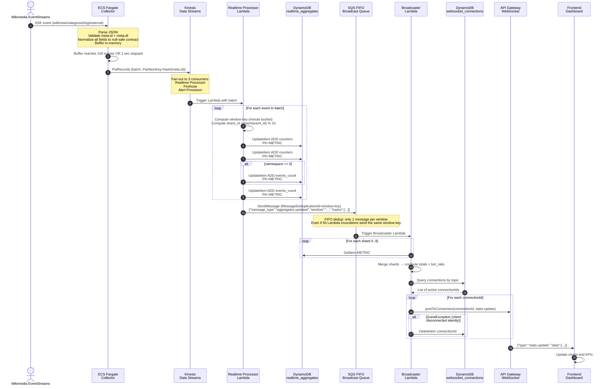
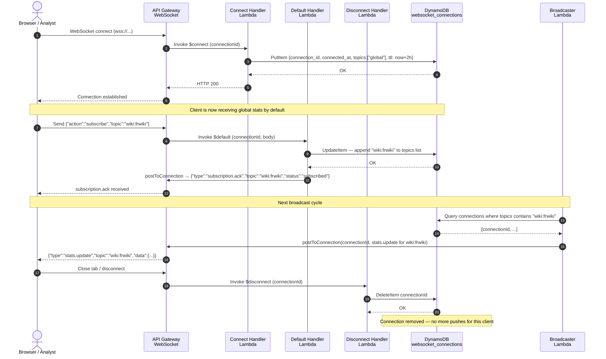
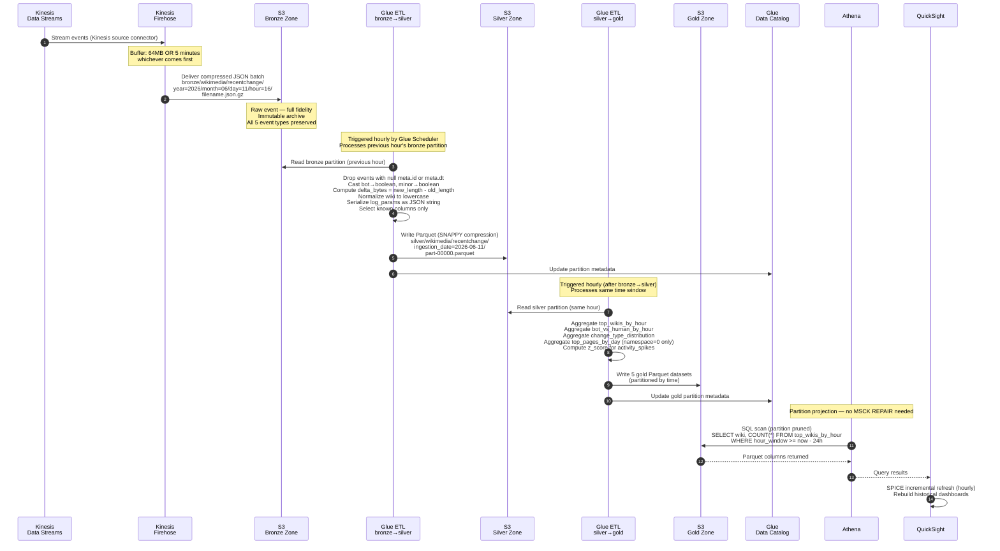
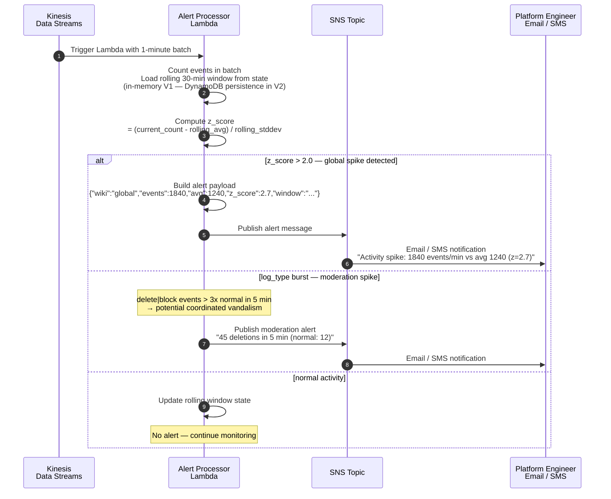
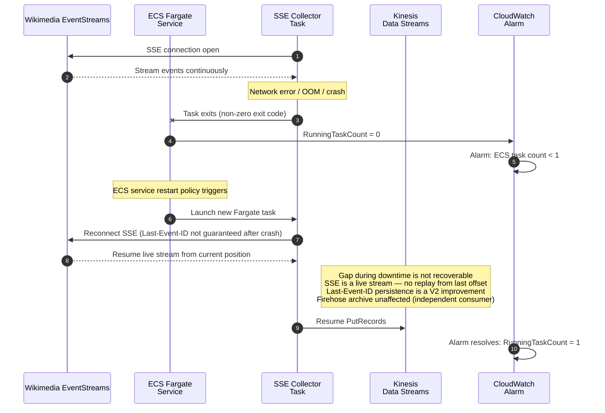
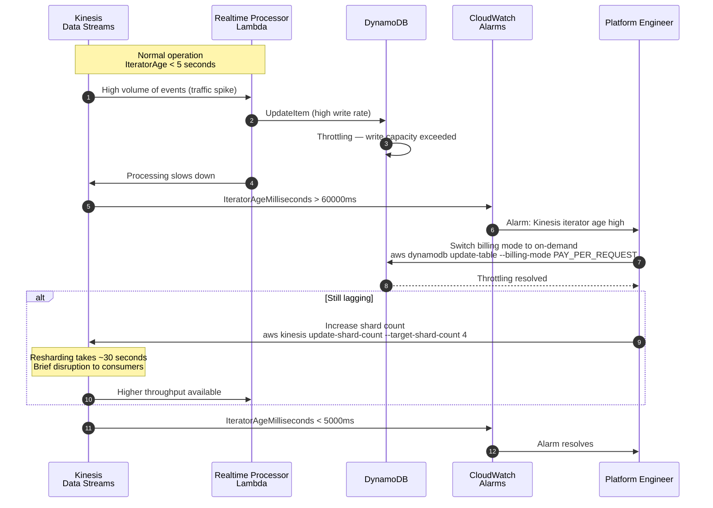
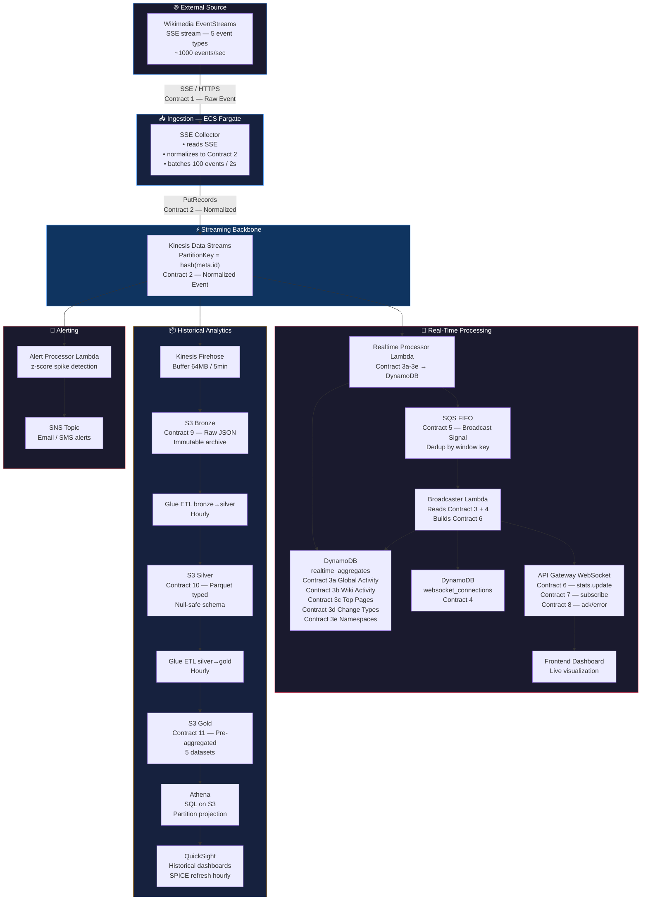

# Architecture Diagrams — Realtime Media Analytics Platform
# Format: Mermaid — renderable in GitHub, GitLab, Notion, VSCode

---

## DIAGRAM 1 — C4 Level 1 : System Context



---

## DIAGRAM 2 — C4 Level 2 : Container Diagram



---

## DIAGRAM 3 — Sequence : Full Ingestion → Realtime Dashboard Flow



---

## DIAGRAM 4 — Sequence : WebSocket Lifecycle (Connect → Subscribe → Receive → Disconnect)



---

## DIAGRAM 5 — Sequence : Historical Archive Pipeline (Kinesis → S3 → Glue → Athena)



---

## DIAGRAM 6 — Sequence : Alert Processor (Spike Detection)



---

## DIAGRAM 7 — Sequence : Collector Crash Recovery



---

## DIAGRAM 8 — Sequence : Kinesis High Iterator Age Recovery



---

## DIAGRAM 9 — Data Flow : All Contracts in One View



---

## DIAGRAM 10 — DynamoDB Access Patterns

```mermaid
erDiagram
  REALTIME_AGGREGATES {
    string PK "METRIC#GLOBAL_ACTIVITY#SHARD#n"
    string SK "WINDOW#2026-06-11T16:44"
    number events_count
    number bot_events
    number human_events
    number edit_events
    number new_events
    number categorize_events
    number log_events
    number external_events
    number ttl "window_start + 2h"
  }

  WIKI_AGGREGATES {
    string PK "METRIC#WIKI_ACTIVITY#WIKI#enwiki"
    string SK "WINDOW#2026-06-11T16:44"
    number events_count
    number bot_events
    number human_events
    number edit_events
    number new_events
    number categorize_events
    number log_events
    number external_events
    number ttl "window_start + 2h"
  }

  TOP_PAGES {
    string PK "METRIC#TOP_PAGES#WIKI#enwiki"
    string SK "WINDOW#2026-06-11T16:44#TITLE#Scale AI"
    number events_count
    string last_change_type
    string last_seen_at
    number ttl "window_start + 2h"
  }

  CHANGE_TYPE {
    string PK "METRIC#CHANGE_TYPE#TYPE#edit"
    string SK "WINDOW#2026-06-11T16:44"
    number events_count
    number ttl "window_start + 2h"
  }

  WEBSOCKET_CONNECTIONS {
    string PK "connection_id"
    string connected_at
    string client_type
    list topics "global, wiki:enwiki, top_pages"
    number ttl "connected_at + 2h"
  }
```