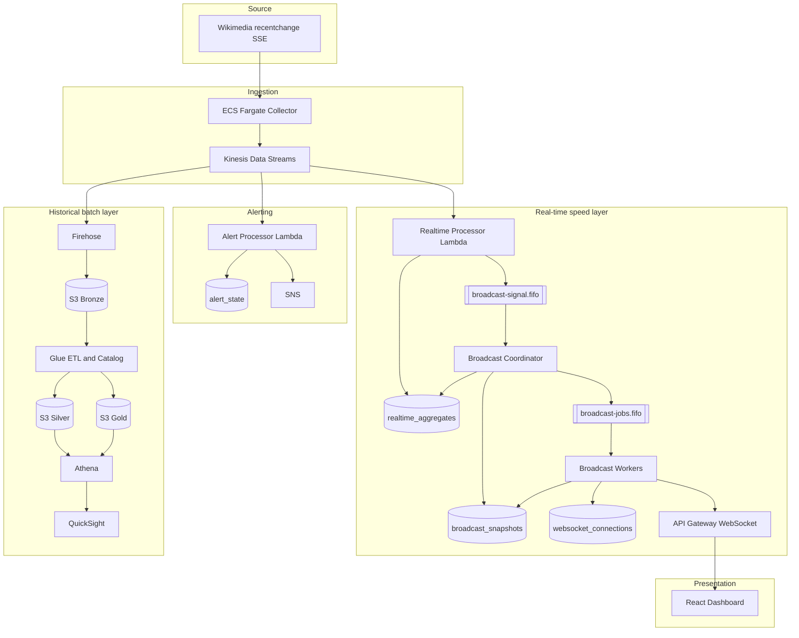

# Architecture — Realtime Media Analytics Platform V2

## 1. Purpose

The platform converts a public, high-volume Wikimedia SSE feed into four products:

1. a low-latency live dashboard;
2. topic-specific WebSocket subscriptions;
3. automated activity alerts;
4. a durable historical analytics lake.

The system is designed as a learning-grade but production-style architecture. It prioritizes decoupling, observable failure modes, bounded concurrency and explicit delivery semantics.

## 2. Quality attributes

| Attribute | Design response |
|---|---|
| Low latency | 1-second Collector flush, 1-second Kinesis batch window, 3-second broadcast coalescing, parallel fan-out |
| Elasticity | Lambda consumers, FIFO message groups, logical connection shards |
| Decoupling | Kinesis between producer/consumers; SQS between aggregation/coordinator/workers |
| Durability | 48-hour Kinesis retention, SQS DLQs, S3 Bronze archive |
| Read efficiency | DynamoDB materialized aggregates and immutable snapshots |
| Failure isolation | Separate Realtime, Alert, Coordinator and Worker Lambdas |
| Observability | OTel metrics/traces, structured logs, AWS native metrics |
| Security | least-privilege IAM, KMS encryption, TLS, private collector networking |
| Cost control | deterministic sampling, PAY_PER_REQUEST DynamoDB, serverless compute |

## 3. System topology



## 4. Component responsibilities

### 4.1 Wikimedia EventStreams

Source endpoint: `https://stream.wikimedia.org/v2/stream/recentchange`.

The platform treats Wikimedia `meta.id` as the source identity and `meta.dt` as the source event time used for freshness.

### 4.2 ECS Fargate Collector

Source: `services/collector/src/main.py`.

Responsibilities:

- maintain a long-lived HTTPS/SSE connection;
- parse only `data:` lines;
- require `meta.id` and `meta.dt`;
- drop Wikimedia canary events;
- deterministically sample by normalized `event_id`;
- create the normalized envelope and retain `raw_event`;
- buffer events and call Kinesis `PutRecords`;
- retry only failed `PutRecords` entries;
- inject W3C trace context into each Kinesis record;
- reconnect to SSE after disconnects;
- flush telemetry during graceful ECS shutdown.

Why ECS rather than Lambda: SSE is a long-running connection, while Lambda is optimized for finite invocations.

Current dev behavior:

```text
sample_rate = 0.05
batch_size = 100
flush_interval = 1 second
one task
```

### 4.3 Kinesis Data Streams

Kinesis is the event backbone and short-term replay buffer. One retained event is independently consumed by:

- Realtime Processor Lambda;
- Alert Processor Lambda;
- Firehose.

Current mode is provisioned with one shard and 48-hour retention. `event_id` is the partition key, favoring even distribution rather than wiki-level ordering.

Kinesis ordering is guaranteed only inside a shard in write order. The platform does not require global ordering because real-time aggregates are additions and min/max operations grouped by source event time.

### 4.4 Realtime Processor Lambda

Source: `services/realtime-processor/src/handler.py`.

Responsibilities:

- decode normalized Kinesis records;
- accept only `event_type = wiki.recentchange`;
- convert `occurred_at` to source epoch milliseconds;
- assign events to 60-second event-time windows;
- aggregate the Lambda batch in memory;
- update DynamoDB counters in bounded parallelism;
- compute updated business topics;
- compute oldest/latest timestamps per window and per topic;
- send one coalesced `aggregates.updated` signal to SQS FIFO.

It creates these read models:

```text
GLOBAL_ACTIVITY, write-sharded by event_id
WIKI_ACTIVITY
TOP_WIKIS, write-sharded by wiki
CHANGE_TYPE and WIKI_CHANGE_TYPE
BOT_ACTIVITY and WIKI_BOT_ACTIVITY
NAMESPACE and WIKI_NAMESPACE
TOP_PAGES, write-sharded by wiki/title identity
```

DynamoDB writes use atomic `ADD event_count` and `SET` metadata. This avoids read-modify-write races but is not fully idempotent under partial batch success followed by Kinesis replay.

### 4.5 `realtime_aggregates` table

Key schema:

```text
PK metric_key
SK window_key
```

The table stores only materialized counters, not raw events. TTL is normally two days. Detailed key contracts are in `data-contracts.md`.

### 4.6 `broadcast-signal.fifo`

Producer: Realtime Processor. Consumer: Coordinator.

The queue is a control-plane notification, not a data store. The message tells the Coordinator which event-time windows and topics changed and carries their timestamp bounds.

All messages use:

```text
MessageGroupId = realtime-broadcast
```

Therefore Coordinator signals are processed sequentially.

The FIFO deduplication ID is based on:

```text
broadcast sequence (3-second bucket)
+ sorted aggregation windows
+ sorted updated topics
```

Two batches with the same combination inside the same 3-second bucket are coalesced. The second batch still updates DynamoDB; only its signal can be deduplicated.

### 4.7 Broadcast Coordinator Lambda

Source: `services/broadcast-coordinator/src/handler.py`.

The Coordinator converts mutable aggregate state into immutable distribution artifacts.

For every signal it:

1. validates `message_type`;
2. derives a canonical `source_signal_id`;
3. acquires a DynamoDB idempotency lease;
4. reads the requested aggregate windows/topics;
5. builds one immutable snapshot per topic/window;
6. creates a manifest referencing those snapshots;
7. conditionally advances the strongly consistent `LATEST` pointer;
8. publishes exactly one job per connection shard for the newest manifest;
9. marks the idempotency record complete.

The Coordinator uses 24 bounded DynamoDB read workers and a 32-connection SDK pool.

### 4.8 `broadcast_snapshots` table

Key schema:

```text
PK snapshot_id
SK topic
```

Item types:

- `SNAPSHOT`: immutable topic payload and freshness references;
- `MANIFEST`: immutable map from topic to snapshot reference;
- `POINTER`: singleton `LATEST / MANIFEST` cursor;
- `IDEMPOTENCY`: Coordinator lease/result record.

Snapshots/manifests expire after 900 seconds. `LATEST` has no TTL.

### 4.9 `broadcast-jobs.fifo`

Producer: Coordinator. Consumer: Worker Lambda event source mapping.

One job represents one complete logical connection shard.

```text
MessageGroupId = SHARD#00 ... SHARD#09
MessageDeduplicationId = SHA256(manifest_id | connection_shard)
```

FIFO provides order within each connection shard while different shards execute concurrently.

### 4.10 Broadcast Worker Lambda

Source: `services/broadcast-worker/src/handler.py`.

For one shard job the Worker:

1. validates the job contract;
2. reads `LATEST` with a strongly consistent `GetItem`;
3. skips the job if it is stale;
4. loads the immutable manifest;
5. queries `websocket_connections` through `connection-shard-index`;
6. computes the union of topics required by those connections;
7. BatchGets only required snapshots;
8. groups updates per connection;
9. chunks payloads below 30,000 bytes with a 512-byte safety margin;
10. checks `LATEST` again immediately before sending;
11. fans out with 16 threads and a 24-connection HTTPS pool;
12. retries retryable API Gateway failures up to 3 attempts;
13. cleans up HTTP 410/Gone connections;
14. records delivery outcome and freshness.

A Worker never scans all connections. Each Worker processes one of the 10 GSI partitions.

### 4.11 `websocket_connections` table

Key schema:

```text
PK connection_id
GSI connection-shard-index:
  PK connection_shard
  SK connection_id
```

Every connection contains its deterministic shard and full topic list. This table is the authoritative source used by V2 Workers.

The uploaded branch still dual-writes a transitional `websocket_subscriptions` table. V2 Workers do not use it to discover recipients; they use it only during stale-connection cleanup. It should be removed after the lifecycle handlers are simplified.

### 4.12 API Gateway WebSocket and lifecycle handlers

Routes:

```text
$connect    → websocket-connect-handler
$disconnect → websocket-disconnect-handler
$default    → websocket-default-handler
```

The custom hostname is `wss://stream-websocket.talelkarimchebbi.com`. Root mapping points to the active `dev` stage, so clients do not append `/dev`.

On connect, the client is subscribed to `global` and assigned a deterministic connection shard. Subscribe/unsubscribe updates the connection topic list transactionally and sends `subscription.ack` through the API Gateway Management API.

### 4.13 React dashboard

The frontend:

- opens a native browser WebSocket;
- reconnects with exponential backoff and jitter;
- periodically sends heartbeat messages;
- resubscribes after reconnect;
- accepts `stats.batch_update` chunks;
- normalizes per-topic payloads;
- maintains an in-memory `(sequence, aggregation_window_epoch_ms)` cursor;
- rejects strictly older cursors;
- accepts multiple chunks with the same cursor.

The cursor is intentionally reset on a browser refresh.

### 4.14 Alert Processor

The Alert Processor consumes Kinesis independently with a larger batch/window than the live path. It creates minute counters in `alert_state`, then evaluates:

- global activity z-score;
- per-wiki activity z-score;
- delete and block moderation burst ratios.

Alert reservation uses conditional DynamoDB state before SNS publication to prevent repeated notifications for the same alert key/window.

### 4.15 Historical analytics

Firehose writes normalized envelopes to S3 Bronze with a 64 MiB or 300-second buffer. Glue jobs convert Bronze to Silver Parquet and Silver to Gold business datasets. Athena and QuickSight query the optimized layers.

## 5. Broadcasting V2 control and data planes

### Control plane

```text
aggregates.updated signal
→ Coordinator idempotency
→ manifest selection
→ LATEST pointer
→ shard jobs
```

### Data plane

```text
immutable snapshots
+ connection-shard query
→ per-connection envelope
→ API Gateway postToConnection
```

Separating the planes prevents every Worker from rebuilding the same aggregate payload.

## 6. Latest State Wins

The `LATEST` pointer orders broadcasts by:

```text
sequence first
aggregation_window_epoch_ms second
```

Workers perform two checks:

```text
before loading manifest/connections/snapshots
immediately before fan-out
```

A stale job returns success without sending, so FIFO can advance to a newer job. This prevents unbounded accumulation when broadcast production temporarily exceeds fan-out speed.

## 7. Chunking

A connection can subscribe to up to 50 topics. The Worker builds a batch envelope containing multiple topic updates. If the serialized payload exceeds the safe limit, it partitions updates into multiple envelopes.

Every chunk carries the same broadcast cursor and:

```text
chunk_index: zero-based
chunk_count: total number of chunks
```

The frontend must not reject equal-cursor chunks. It rejects only strictly older cursors.

## 8. Retry and failure model

### Kinesis consumers

Kinesis/Lambda is at-least-once. A failed batch can be replayed. Atomic DynamoDB increments are concurrency-safe but not replay-idempotent.

### Signal queue

Coordinator structural failure returns `batchItemFailures`; the message becomes visible after 30 seconds and reaches the DLQ after 3 receives.

### Job queue

Worker structural failure returns `batchItemFailures`; visibility timeout is 180 seconds and DLQ threshold is 5 receives.

### Individual WebSocket delivery

Retryable `429`, `5xx`, timeout and connection errors are retried locally up to three attempts with bounded exponential delay and jitter. `410 Gone` is not retried and triggers connection cleanup.

Individual post failures do not fail the complete shard job because replaying successful deliveries would create large duplicate fan-out. The next state supersedes the missed state.

## 9. Freshness semantics

For every successfully sent chunk:

```text
latest_reference_ms = minimum(latest_event_timestamp_ms of updates in chunk)
freshness_ms = postToConnection success time - latest_reference_ms
```

It is conservative for multi-topic chunks because it uses the least-fresh topic. It includes nearly the complete backend path but excludes API Gateway-to-browser delivery and React rendering.

See `freshness-and-slo.md` for the complete audit.

## 10. Observability

- Collector sends OTLP through an Alloy sidecar.
- Realtime Processor, Coordinator and Worker use an OTel Collector Lambda extension.
- Metrics are sent to Grafana Mimir.
- traces are sent to Tempo;
- structured CloudWatch logs are forwarded to Loki by Grafana Lambda Promtail;
- AWS integration supplies native Lambda, SQS, Kinesis, DynamoDB, Firehose and API Gateway metrics.

The Worker deliberately exports only one histogram and two bounded-label counters to avoid Grafana Cloud ingestion throttling.

## 11. Security boundaries

- customer-managed KMS keys for Kinesis, SQS, DynamoDB, S3 and logs;
- separate IAM roles for each Lambda and ECS task;
- Secrets Manager for Collector Grafana authorization;
- TLS for SSE, AWS APIs, WebSocket and OTLP;
- DynamoDB and S3 deletion protection configurable by environment;
- no secrets committed in documentation.

## 12. Scaling boundaries

The architecture scales independently at several axes:

```text
source ingestion      → Kinesis shards
aggregate writes      → DynamoDB write shards
broadcast compute     → connection shards and Worker concurrency
per-Worker throughput → threads and HTTP pool
WebSocket API         → API Gateway account/stage quotas
```

Connection sharding reduces the time per Worker but does not reduce the total number of `postToConnection` calls. Fan-out remains O(number of active connections).

## 13. Honest production critique

The highest-impact gaps are:

- no exactly-once/idempotent aggregate update strategy under partial write success;
- source timestamp and Coordinator aggregate read are not atomically coupled;
- freshness is backend push, not browser-visible freshness;
- one active Collector is a brief outage point during restart;
- one Kinesis shard is not justified by shard-level capacity metrics;
- alert windows use a pragmatic delay rather than a formal watermark;
- transitional `websocket_subscriptions` and legacy Broadcaster remain in the branch;
- the 10,000-connection proof is mainly a fan-out test and was global-topic focused.

These are documented in `known-limitations.md` with remediation priorities.
