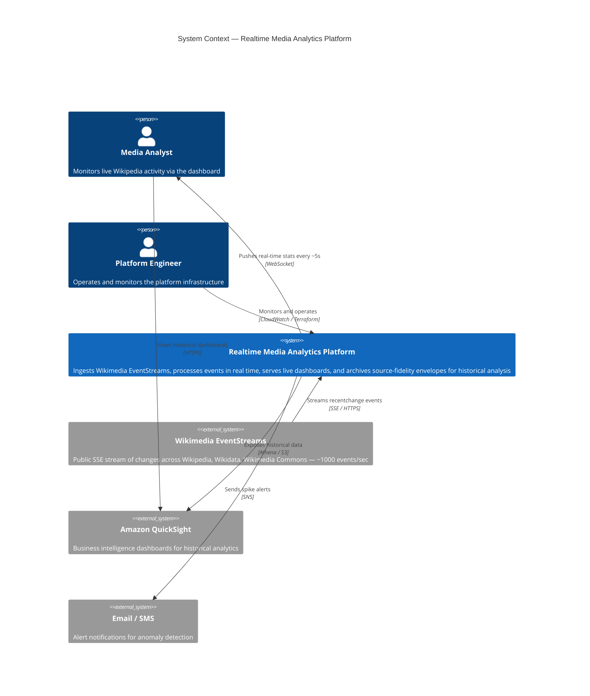
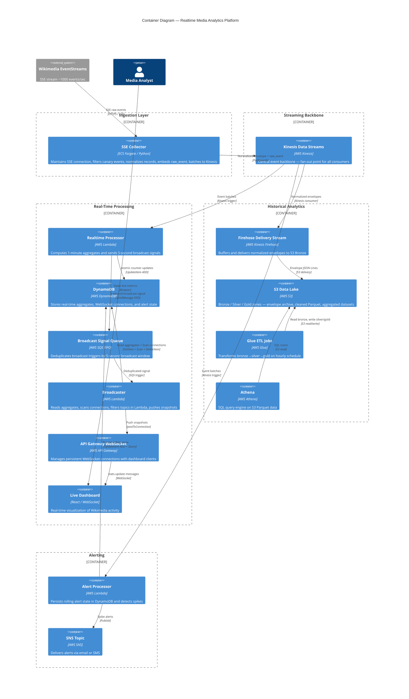

# Architecture Diagrams — Realtime Media Analytics Platform
# Format: Mermaid — renderable in GitHub, GitLab, Notion, VSCode

---

## DIAGRAM 1 — C4 Level 1 : System Context

---

## DIAGRAM 2 — C4 Level 2 : Container Diagram

