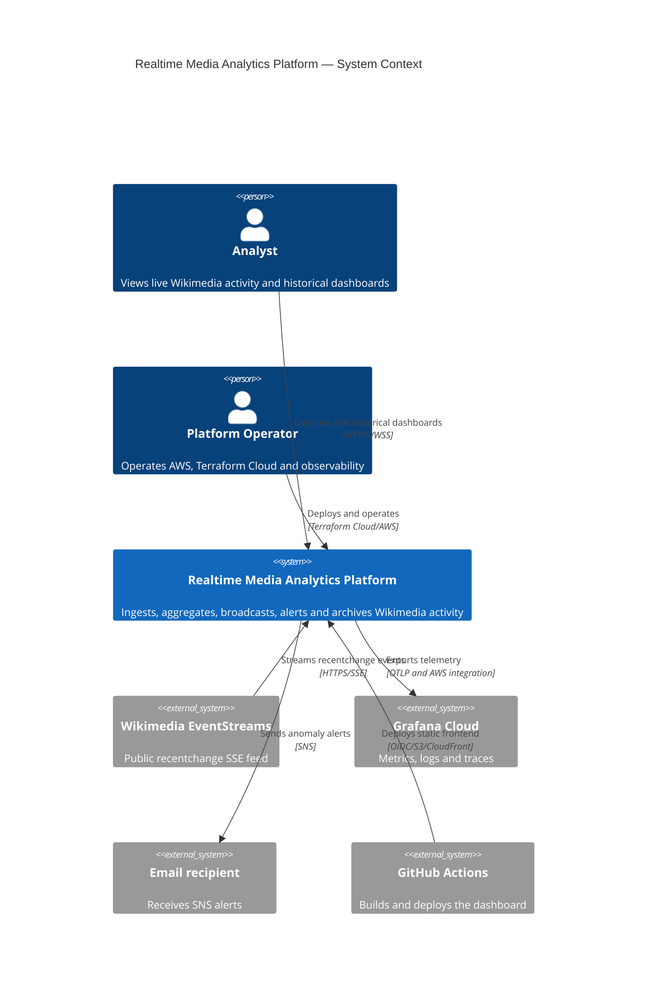
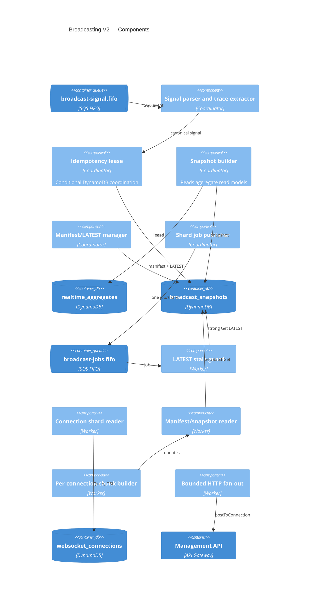
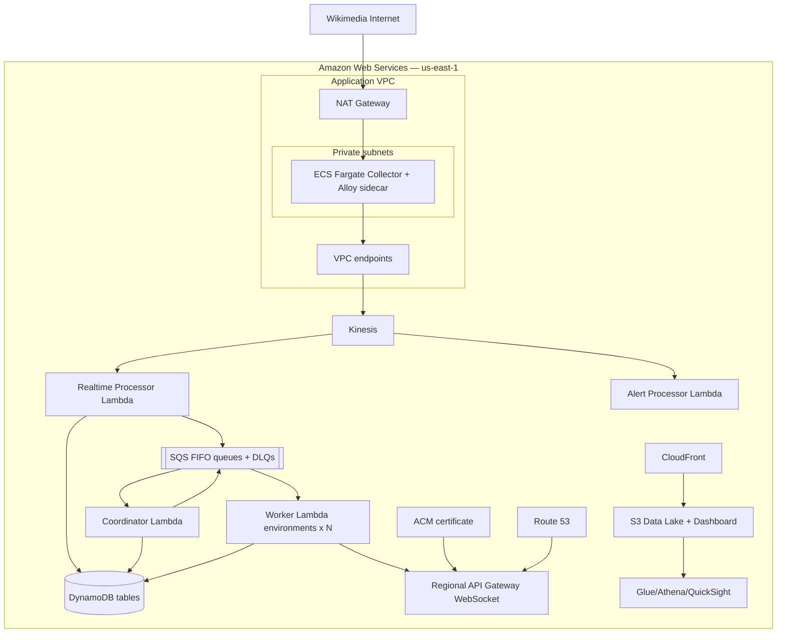

# C4 Diagrams — V2

## 1. System context

```mermaid
C4Context
  title Realtime Media Analytics Platform — System Context

  Person(analyst, "Analyst", "Views live Wikimedia activity and historical dashboards")
  Person(operator, "Platform Operator", "Operates AWS, Terraform Cloud and observability")

  System(platform, "Realtime Media Analytics Platform", "Ingests, aggregates, broadcasts, alerts and archives Wikimedia activity")
  System_Ext(wikimedia, "Wikimedia EventStreams", "Public recentchange SSE feed")
  System_Ext(grafana, "Grafana Cloud", "Metrics, logs and traces")
  System_Ext(email, "Email recipient", "Receives SNS alerts")
  System_Ext(github, "GitHub Actions", "Builds and deploys the dashboard")

  Rel(wikimedia, platform, "Streams recentchange events", "HTTPS/SSE")
  Rel(analyst, platform, "Uses live and historical dashboards", "HTTPS/WSS")
  Rel(platform, grafana, "Exports telemetry", "OTLP and AWS integration")
  Rel(platform, email, "Sends anomaly alerts", "SNS")
  Rel(operator, platform, "Deploys and operates", "Terraform Cloud/AWS")
  Rel(github, platform, "Deploys static frontend", "OIDC/S3/CloudFront")
```

## 2. Container view

```mermaid
C4Container
  title Realtime Media Analytics Platform — Containers

  Person(analyst, "Analyst")
  System_Ext(wikimedia, "Wikimedia EventStreams")
  System_Ext(grafana, "Grafana Cloud")

  Container(collector, "Collector", "ECS Fargate / Python", "Maintains SSE, validates, samples and publishes normalized envelopes")
  Container(kinesis, "Event Backbone", "Kinesis Data Streams", "Retains and fans out source events")
  Container(realtime, "Realtime Processor", "AWS Lambda / Python", "Builds event-time aggregates and broadcast signals")
  Container(alert, "Alert Processor", "AWS Lambda / Python", "Builds baselines and publishes alerts")
  ContainerDb(aggregates, "Realtime Aggregates", "DynamoDB", "Materialized 1-minute counters")
  ContainerQueue(signal, "Broadcast Signal", "SQS FIFO", "Sequential coalesced coordination requests")
  Container(coordinator, "Broadcast Coordinator", "AWS Lambda / Python", "Creates immutable snapshots/manifests and shard jobs")
  ContainerDb(snapshots, "Broadcast Snapshots", "DynamoDB", "Snapshots, manifests, LATEST and idempotency")
  ContainerQueue(jobs, "Broadcast Jobs", "SQS FIFO", "One ordered job per connection shard")
  Container(worker, "Broadcast Workers", "AWS Lambda / Python", "Queries shard recipients, chunks and fans out")
  ContainerDb(connections, "WebSocket Connections", "DynamoDB", "Connection topic lists and shard GSI")
  Container(apigw, "WebSocket API", "API Gateway v2", "Connection lifecycle and frame delivery")
  Container(frontend, "Live Dashboard", "React/Vite/S3/CloudFront", "Displays live topic snapshots")
  Container(firehose, "Delivery Stream", "Kinesis Firehose", "Buffers source envelopes to S3")
  ContainerDb(lake, "Medallion Data Lake", "S3/Glue/Athena", "Bronze, Silver and Gold analytics")
  Container(quicksight, "Historical Dashboard", "QuickSight", "Business intelligence")

  Rel(wikimedia, collector, "SSE")
  Rel(collector, kinesis, "PutRecords")
  Rel(kinesis, realtime, "Lambda event source mapping")
  Rel(kinesis, alert, "Lambda event source mapping")
  Rel(kinesis, firehose, "Source stream")
  Rel(realtime, aggregates, "Atomic UpdateItem")
  Rel(realtime, signal, "SendMessage FIFO")
  Rel(signal, coordinator, "batch_size=1")
  Rel(coordinator, aggregates, "BatchGet/Query")
  Rel(coordinator, snapshots, "Put/Update")
  Rel(coordinator, jobs, "SendMessageBatch")
  Rel(jobs, worker, "Parallel MessageGroupIds")
  Rel(worker, snapshots, "Get/BatchGet")
  Rel(worker, connections, "Query GSI")
  Rel(worker, apigw, "postToConnection")
  Rel(apigw, frontend, "WSS frames")
  Rel(frontend, apigw, "Connect/subscribe/heartbeat")
  Rel(firehose, lake, "JSONL GZIP")
  Rel(lake, quicksight, "Athena datasets")
  Rel(analyst, frontend, "HTTPS")
  Rel(analyst, quicksight, "HTTPS")
  Rel(collector, grafana, "OTLP through Alloy")
  Rel(realtime, grafana, "OTLP extension")
  Rel(coordinator, grafana, "OTLP extension")
  Rel(worker, grafana, "OTLP extension")
```

## 3. Broadcasting component view

```mermaid
C4Component
  title Broadcasting V2 — Components

  ContainerQueue(signal, "broadcast-signal.fifo", "SQS FIFO")
  Component(signalParser, "Signal parser and trace extractor", "Coordinator")
  Component(idempotency, "Idempotency lease", "Coordinator", "Conditional DynamoDB coordination")
  Component(snapshotBuilder, "Snapshot builder", "Coordinator", "Reads aggregate read models")
  Component(manifestBuilder, "Manifest/LATEST manager", "Coordinator")
  Component(jobPublisher, "Shard job publisher", "Coordinator")
  ContainerDb(aggregates, "realtime_aggregates", "DynamoDB")
  ContainerDb(snapshotDb, "broadcast_snapshots", "DynamoDB")
  ContainerQueue(jobs, "broadcast-jobs.fifo", "SQS FIFO")
  Component(staleGuard, "LATEST stale guard", "Worker")
  Component(connectionReader, "Connection shard reader", "Worker")
  Component(snapshotReader, "Manifest/snapshot reader", "Worker")
  Component(payloadBuilder, "Per-connection chunk builder", "Worker")
  Component(fanout, "Bounded HTTP fan-out", "Worker")
  ContainerDb(connections, "websocket_connections", "DynamoDB")
  Container(apigw, "Management API", "API Gateway")

  Rel(signal, signalParser, "SQS event")
  Rel(signalParser, idempotency, "canonical signal")
  Rel(idempotency, snapshotDb, "lease")
  Rel(snapshotBuilder, aggregates, "read")
  Rel(snapshotBuilder, snapshotDb, "snapshot")
  Rel(manifestBuilder, snapshotDb, "manifest + LATEST")
  Rel(jobPublisher, jobs, "one job/shard")
  Rel(jobs, staleGuard, "job")
  Rel(staleGuard, snapshotDb, "strong Get LATEST")
  Rel(connectionReader, connections, "Query GSI")
  Rel(snapshotReader, snapshotDb, "Get/BatchGet")
  Rel(payloadBuilder, snapshotReader, "updates")
  Rel(fanout, apigw, "postToConnection")
```

## 4. Deployment view

```mermaid
flowchart TB
  subgraph AWS[Amazon Web Services — us-east-1]
    subgraph VPC[Application VPC]
      subgraph Private[Private subnets]
        ECS[ECS Fargate Collector + Alloy sidecar]
      end
      NAT[NAT Gateway]
      VPCE[VPC endpoints]
    end

    KDS[Kinesis]
    L1[Realtime Processor Lambda]
    L2[Alert Processor Lambda]
    L3[Coordinator Lambda]
    L4[Worker Lambda environments x N]
    DDB[(DynamoDB tables)]
    SQS[[SQS FIFO queues + DLQs]]
    APIGW[Regional API Gateway WebSocket]
    R53[Route 53]
    ACM[ACM certificate]
    S3[S3 Data Lake + Dashboard]
    CF[CloudFront]
    GLUE[Glue/Athena/QuickSight]
  end

  WM[Wikimedia Internet] --> NAT --> ECS
  ECS --> VPCE --> KDS
  KDS --> L1
  KDS --> L2
  L1 --> DDB
  L1 --> SQS
  SQS --> L3 --> DDB
  L3 --> SQS --> L4
  L4 --> DDB
  L4 --> APIGW
  ACM --> APIGW
  R53 --> APIGW
  CF --> S3
  S3 --> GLUE
```

## 5. Boundary notes

- API Gateway owns physical WebSocket connection state.
- DynamoDB stores application connection metadata and subscriptions.
- Workers do not hold persistent client sockets; they call the API Gateway Management API.
- The Collector is the only long-running business compute component.
- Grafana Cloud is external to the AWS account; Lambda telemetry first reaches a local extension.
