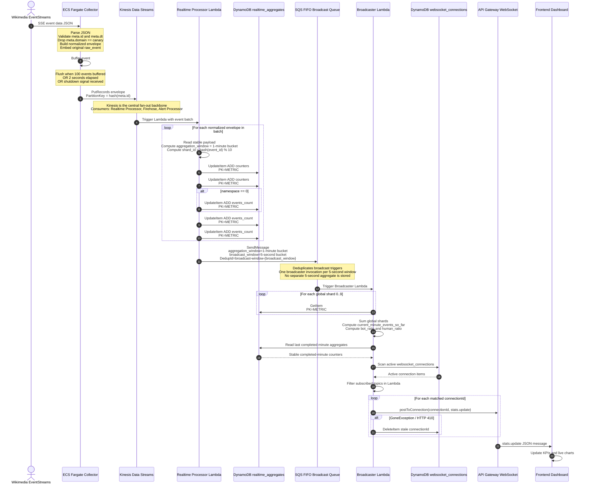
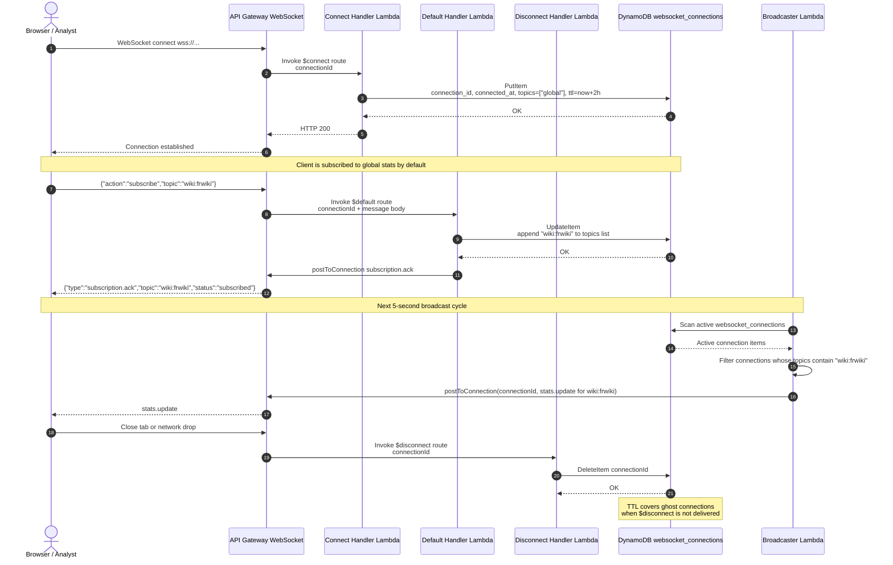
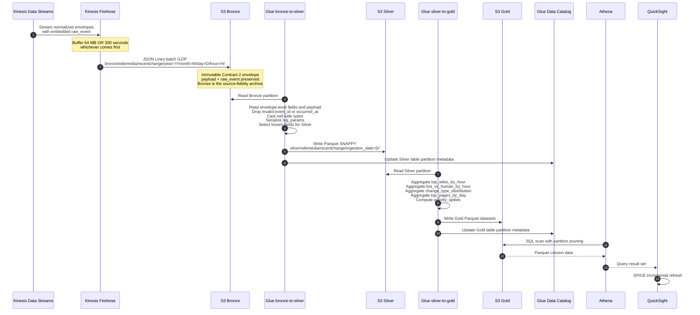
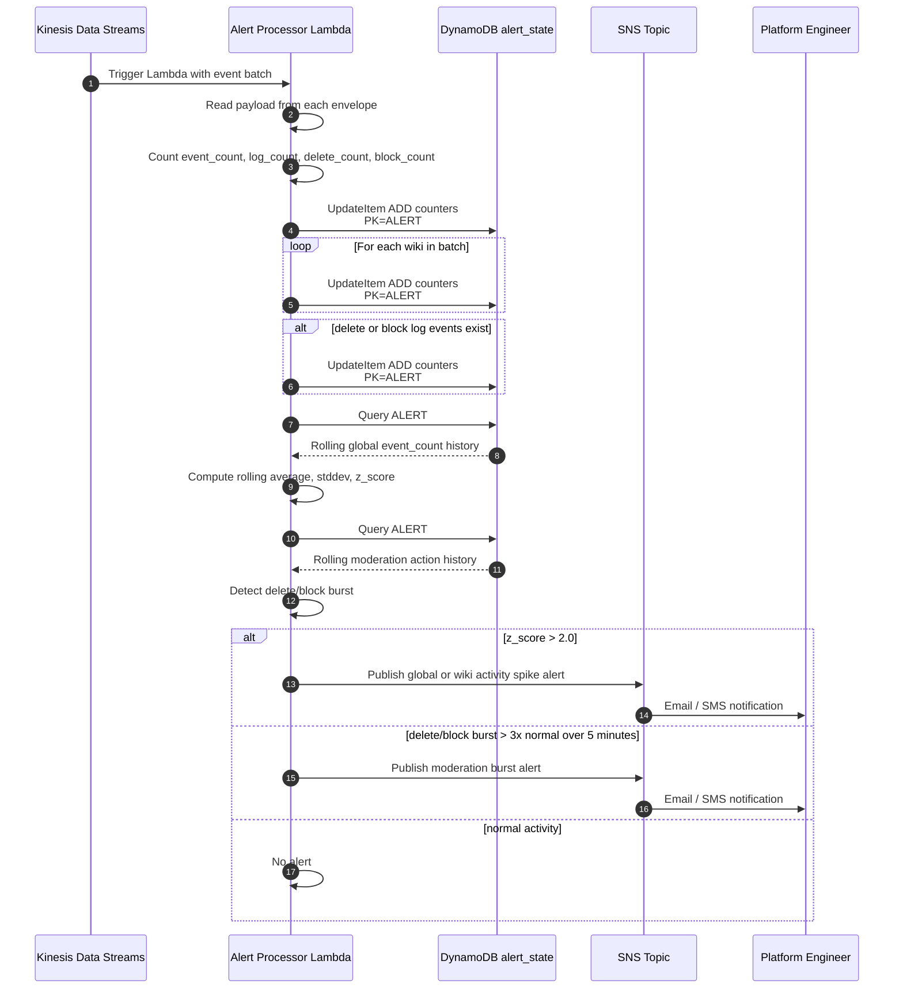
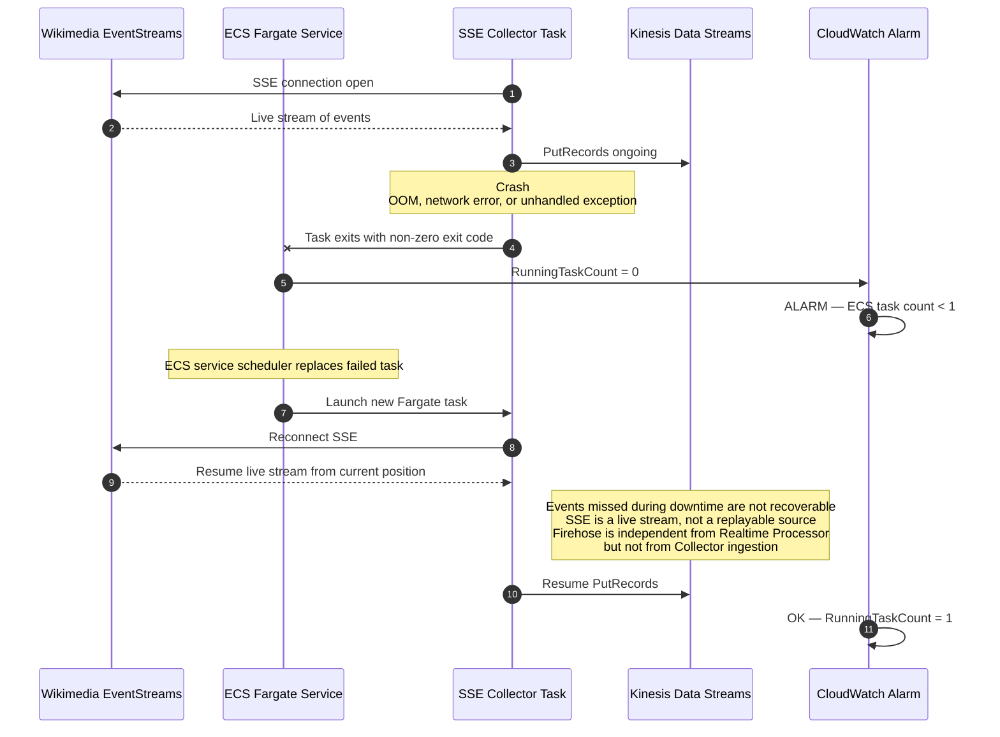
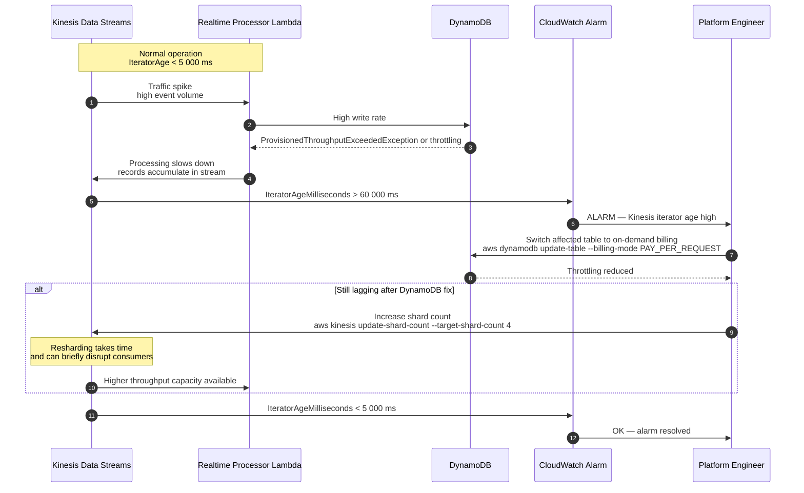

# Sequence Diagrams — Realtime Media Analytics Platform

Render at: https://mermaid.live
GitHub and GitLab render Mermaid natively inside Markdown files.

---

## Diagram 1 — Full Ingestion to Live Dashboard

---

## Diagram 2 — WebSocket Lifecycle

---

## Diagram 3 — Historical Archive Pipeline

---

## Diagram 4 — Alert Processor

---

## Diagram 5 — Collector Crash Recovery

---

## Diagram 6 — Kinesis High Iterator Age Recovery

