# Sequence Diagrams — V2

All diagrams describe the active Coordinator/Worker design. Render with GitHub Mermaid or Mermaid Live.

## 1. Full source-to-browser path

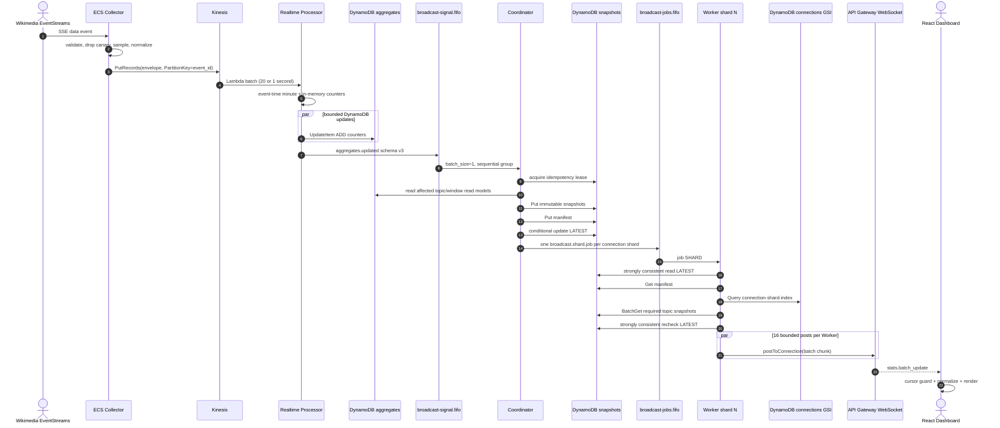
```mermaid
sequenceDiagram
  autonumber
  actor WM as Wikimedia EventStreams
  participant COL as ECS Collector
  participant KDS as Kinesis
  participant RTP as Realtime Processor
  participant AGG as DynamoDB aggregates
  participant SIG as broadcast-signal.fifo
  participant CO as Coordinator
  participant SNAP as DynamoDB snapshots
  participant JOB as broadcast-jobs.fifo
  participant WK as Worker shard N
  participant CONN as DynamoDB connections GSI
  participant AGW as API Gateway WebSocket
  actor UI as React Dashboard

  WM->>COL: SSE data event
  COL->>COL: validate, drop canary, sample, normalize
  COL->>KDS: PutRecords(envelope, PartitionKey=event_id)
  KDS->>RTP: Lambda batch (20 or 1 second)
  RTP->>RTP: event-time minute + in-memory counters
  par bounded DynamoDB updates
    RTP->>AGG: UpdateItem ADD counters
  end
  RTP->>SIG: aggregates.updated schema v3
  SIG->>CO: batch_size=1, sequential group
  CO->>SNAP: acquire idempotency lease
  CO->>AGG: read affected topic/window read models
  CO->>SNAP: Put immutable snapshots
  CO->>SNAP: Put manifest
  CO->>SNAP: conditional update LATEST
  CO->>JOB: one broadcast.shard.job per connection shard
  JOB->>WK: job SHARD#NN
  WK->>SNAP: strongly consistent read LATEST
  WK->>SNAP: Get manifest
  WK->>CONN: Query connection-shard-index
  WK->>SNAP: BatchGet required topic snapshots
  WK->>SNAP: strongly consistent recheck LATEST
  par 16 bounded posts per Worker
    WK->>AGW: postToConnection(batch chunk)
  end
  AGW-->>UI: stats.batch_update
  UI->>UI: cursor guard + normalize + render
```

## 2. Collector buffering and retry

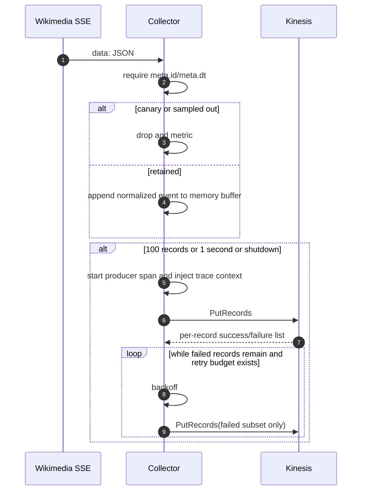
```mermaid
sequenceDiagram
  autonumber
  participant WM as Wikimedia SSE
  participant COL as Collector
  participant KDS as Kinesis

  WM->>COL: data: JSON
  COL->>COL: require meta.id/meta.dt
  alt canary or sampled out
    COL->>COL: drop and metric
  else retained
    COL->>COL: append normalized event to memory buffer
  end

  alt 100 records or 1 second or shutdown
    COL->>COL: start producer span and inject trace context
    COL->>KDS: PutRecords
    KDS-->>COL: per-record success/failure list
    loop while failed records remain and retry budget exists
      COL->>COL: backoff
      COL->>KDS: PutRecords(failed subset only)
    end
  end
```

## 3. Broadcast signal deduplication

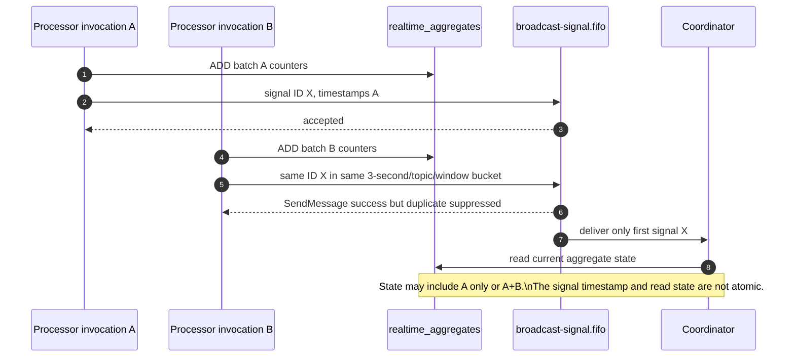
```mermaid
sequenceDiagram
  autonumber
  participant A as Processor invocation A
  participant B as Processor invocation B
  participant DDB as realtime_aggregates
  participant SQS as broadcast-signal.fifo
  participant CO as Coordinator

  A->>DDB: ADD batch A counters
  A->>SQS: signal ID X, timestamps A
  SQS-->>A: accepted
  B->>DDB: ADD batch B counters
  B->>SQS: same ID X in same 3-second/topic/window bucket
  SQS-->>B: SendMessage success but duplicate suppressed
  SQS->>CO: deliver only first signal X
  CO->>DDB: read current aggregate state
  Note over CO,DDB: State may include A only or A+B.\nThe signal timestamp and read state are not atomic.
```

## 4. Coordinator idempotency and artifacts

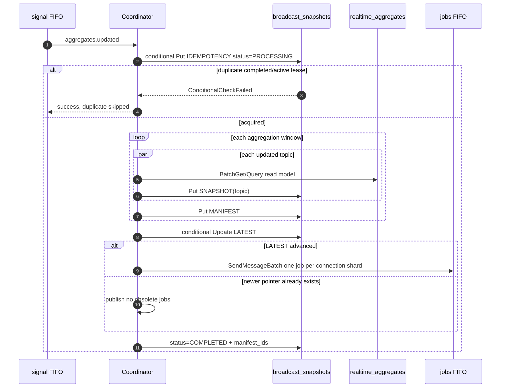
```mermaid
sequenceDiagram
  autonumber
  participant SQS as signal FIFO
  participant CO as Coordinator
  participant DDB as broadcast_snapshots
  participant AGG as realtime_aggregates
  participant JOB as jobs FIFO

  SQS->>CO: aggregates.updated
  CO->>DDB: conditional Put IDEMPOTENCY status=PROCESSING
  alt duplicate completed/active lease
    DDB-->>CO: ConditionalCheckFailed
    CO-->>SQS: success, duplicate skipped
  else acquired
    loop each aggregation window
      par each updated topic
        CO->>AGG: BatchGet/Query read model
        CO->>DDB: Put SNAPSHOT(topic)
      end
      CO->>DDB: Put MANIFEST
    end
    CO->>DDB: conditional Update LATEST
    alt LATEST advanced
      CO->>JOB: SendMessageBatch one job per connection shard
    else newer pointer already exists
      CO->>CO: publish no obsolete jobs
    end
    CO->>DDB: status=COMPLETED + manifest_ids
  end
```

## 5. Worker stale checks

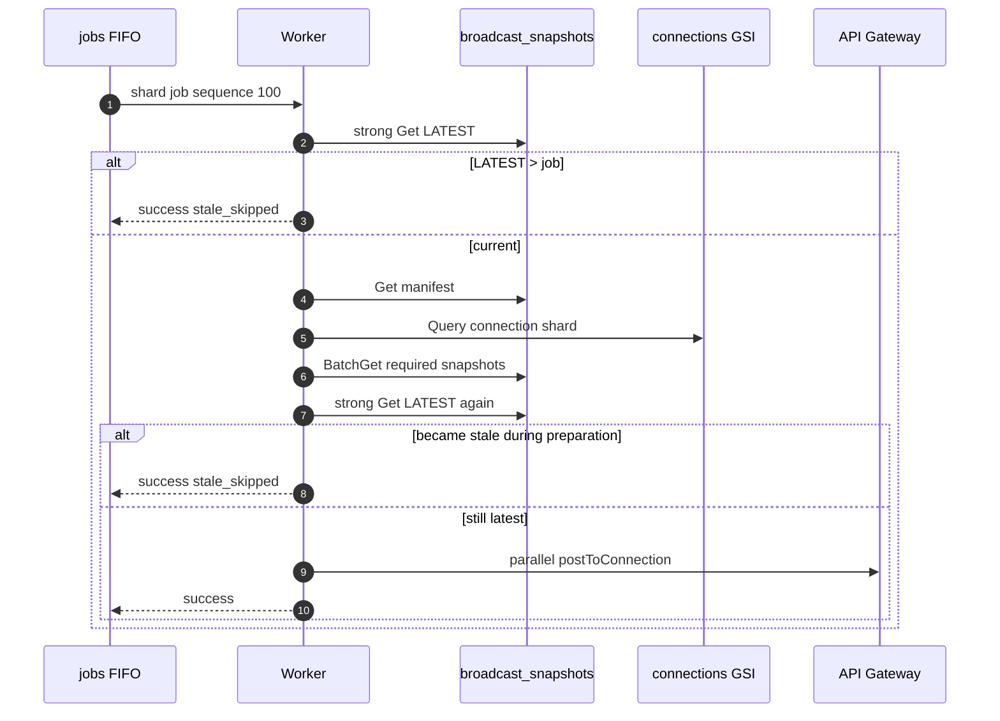
```mermaid
sequenceDiagram
  autonumber
  participant SQS as jobs FIFO
  participant WK as Worker
  participant DDB as broadcast_snapshots
  participant CONN as connections GSI
  participant AGW as API Gateway

  SQS->>WK: shard job sequence 100
  WK->>DDB: strong Get LATEST
  alt LATEST > job
    WK-->>SQS: success stale_skipped
  else current
    WK->>DDB: Get manifest
    WK->>CONN: Query connection shard
    WK->>DDB: BatchGet required snapshots
    WK->>DDB: strong Get LATEST again
    alt became stale during preparation
      WK-->>SQS: success stale_skipped
    else still latest
      WK->>AGW: parallel postToConnection
      WK-->>SQS: success
    end
  end
```

## 6. Per-connection chunking

```mermaid
sequenceDiagram
  autonumber
  participant WK as Worker
  participant AGW as API Gateway
  actor UI as Browser

  WK->>WK: select subscribed topics present in manifest
  WK->>WK: build topic updates
  WK->>WK: greedily group updates below safe byte limit
  Note over WK: Every chunk shares sequence, manifest and window
  par chunk 0
    WK->>AGW: stats.batch_update chunk_index=0 chunk_count=3
    AGW-->>UI: chunk 0
  and chunk 1
    WK->>AGW: stats.batch_update chunk_index=1 chunk_count=3
    AGW-->>UI: chunk 1
  and chunk 2
    WK->>AGW: stats.batch_update chunk_index=2 chunk_count=3
    AGW-->>UI: chunk 2
  end
  UI->>UI: accept equal cursor chunks; reject only older cursor
```

## 7. Post retry and Gone cleanup

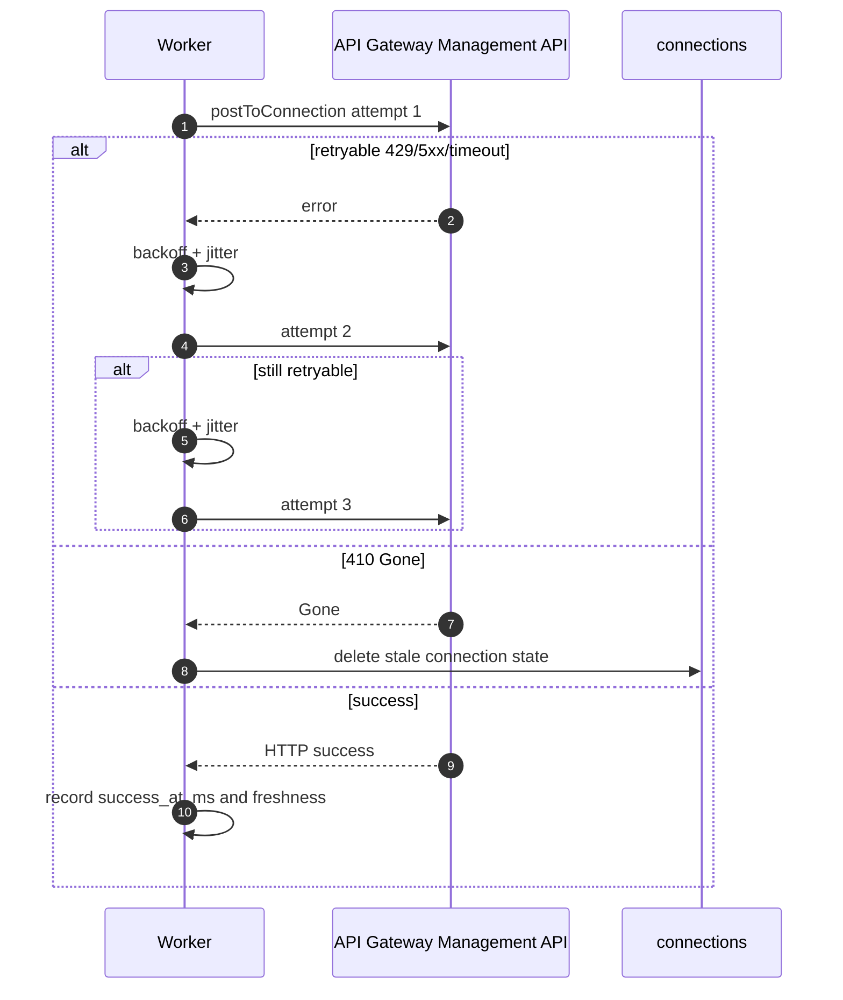
```mermaid
sequenceDiagram
  autonumber
  participant WK as Worker
  participant AGW as API Gateway Management API
  participant DDB as connections

  WK->>AGW: postToConnection attempt 1
  alt retryable 429/5xx/timeout
    AGW-->>WK: error
    WK->>WK: backoff + jitter
    WK->>AGW: attempt 2
    alt still retryable
      WK->>WK: backoff + jitter
      WK->>AGW: attempt 3
    end
  else 410 Gone
    AGW-->>WK: Gone
    WK->>DDB: delete stale connection state
  else success
    AGW-->>WK: HTTP success
    WK->>WK: record success_at_ms and freshness
  end
```

## 8. WebSocket connect

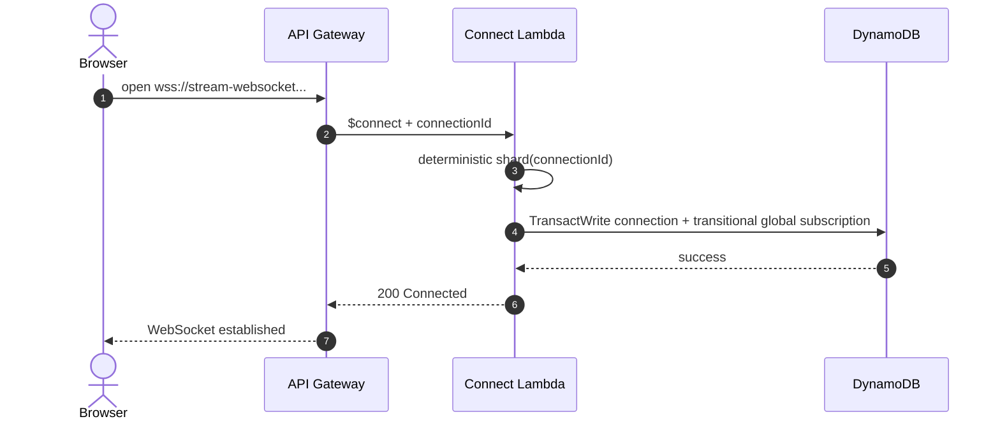
```mermaid
sequenceDiagram
  autonumber
  actor UI as Browser
  participant AGW as API Gateway
  participant CN as Connect Lambda
  participant DDB as DynamoDB

  UI->>AGW: open wss://stream-websocket...
  AGW->>CN: $connect + connectionId
  CN->>CN: deterministic shard(connectionId)
  CN->>DDB: TransactWrite connection + transitional global subscription
  DDB-->>CN: success
  CN-->>AGW: 200 Connected
  AGW-->>UI: WebSocket established
```

## 9. Subscribe/unsubscribe

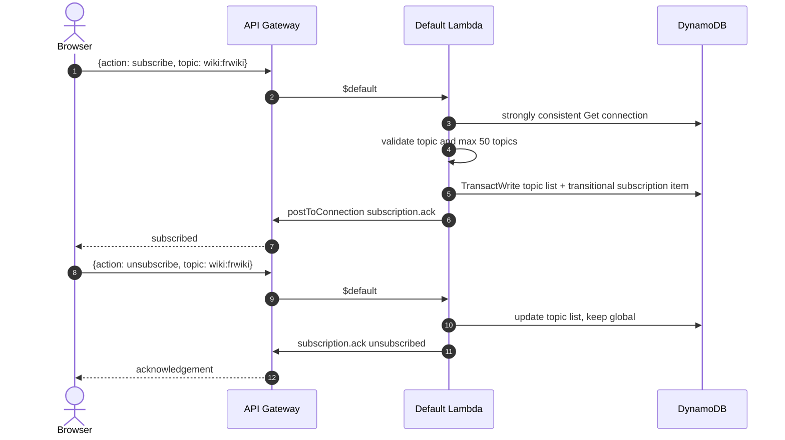
```mermaid
sequenceDiagram
  autonumber
  actor UI as Browser
  participant AGW as API Gateway
  participant DF as Default Lambda
  participant DDB as DynamoDB

  UI->>AGW: {action: subscribe, topic: wiki:frwiki}
  AGW->>DF: $default
  DF->>DDB: strongly consistent Get connection
  DF->>DF: validate topic and max 50 topics
  DF->>DDB: TransactWrite topic list + transitional subscription item
  DF->>AGW: postToConnection subscription.ack
  AGW-->>UI: subscribed

  UI->>AGW: {action: unsubscribe, topic: wiki:frwiki}
  AGW->>DF: $default
  DF->>DDB: update topic list, keep global
  DF->>AGW: subscription.ack unsubscribed
  AGW-->>UI: acknowledgement
```

## 10. Disconnect and TTL fallback

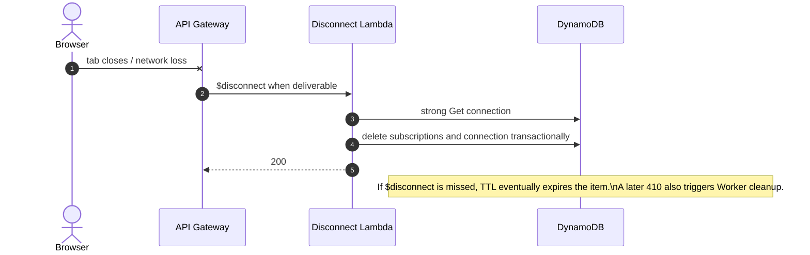
```mermaid
sequenceDiagram
  autonumber
  actor UI as Browser
  participant AGW as API Gateway
  participant DC as Disconnect Lambda
  participant DDB as DynamoDB

  UI-xAGW: tab closes / network loss
  AGW->>DC: $disconnect when deliverable
  DC->>DDB: strong Get connection
  DC->>DDB: delete subscriptions and connection transactionally
  DC-->>AGW: 200
  Note over DDB: If $disconnect is missed, TTL eventually expires the item.\nA later 410 also triggers Worker cleanup.
```

## 11. Alert evaluation

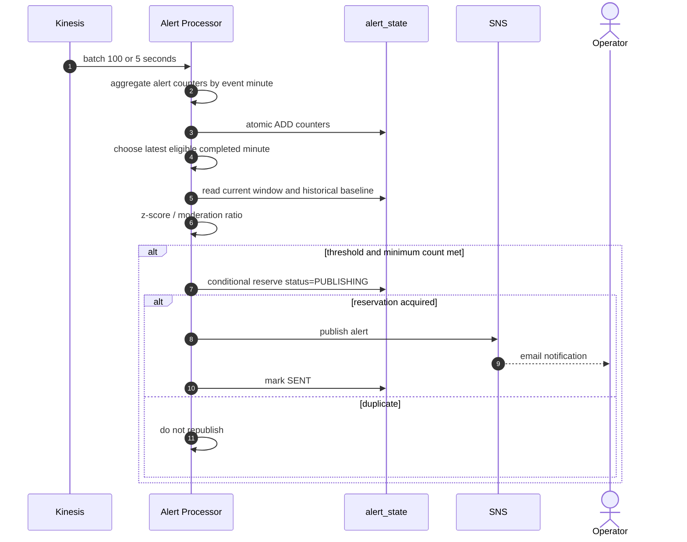
```mermaid
sequenceDiagram
  autonumber
  participant KDS as Kinesis
  participant AL as Alert Processor
  participant DDB as alert_state
  participant SNS as SNS
  actor OPS as Operator

  KDS->>AL: batch 100 or 5 seconds
  AL->>AL: aggregate alert counters by event minute
  AL->>DDB: atomic ADD counters
  AL->>AL: choose latest eligible completed minute
  AL->>DDB: read current window and historical baseline
  AL->>AL: z-score / moderation ratio
  alt threshold and minimum count met
    AL->>DDB: conditional reserve status=PUBLISHING
    alt reservation acquired
      AL->>SNS: publish alert
      SNS-->>OPS: email notification
      AL->>DDB: mark SENT
    else duplicate
      AL->>AL: do not republish
    end
  end
```

## 12. Historical path

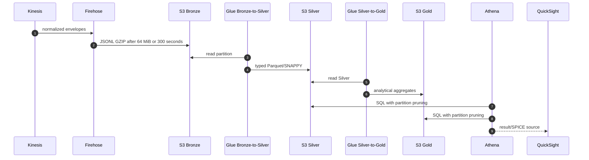
```mermaid
sequenceDiagram
  autonumber
  participant KDS as Kinesis
  participant FH as Firehose
  participant B as S3 Bronze
  participant BS as Glue Bronze-to-Silver
  participant S as S3 Silver
  participant SG as Glue Silver-to-Gold
  participant G as S3 Gold
  participant ATH as Athena
  participant QS as QuickSight

  KDS->>FH: normalized envelopes
  FH->>B: JSONL GZIP after 64 MiB or 300 seconds
  BS->>B: read partition
  BS->>S: typed Parquet/SNAPPY
  SG->>S: read Silver
  SG->>G: analytical aggregates
  ATH->>S: SQL with partition pruning
  ATH->>G: SQL with partition pruning
  ATH-->>QS: result/SPICE source
```

## 13. Trace propagation

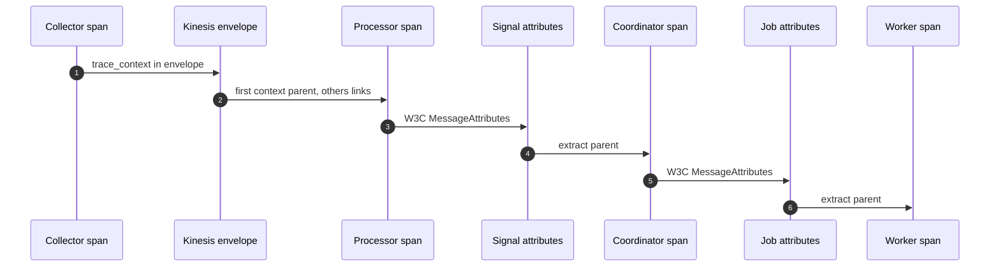
```mermaid
sequenceDiagram
  autonumber
  participant COL as Collector span
  participant KDS as Kinesis envelope
  participant RTP as Processor span
  participant S1 as Signal attributes
  participant CO as Coordinator span
  participant S2 as Job attributes
  participant WK as Worker span

  COL->>KDS: trace_context in envelope
  KDS->>RTP: first context parent, others links
  RTP->>S1: W3C MessageAttributes
  S1->>CO: extract parent
  CO->>S2: W3C MessageAttributes
  S2->>WK: extract parent
```

## 14. Freshness timeline

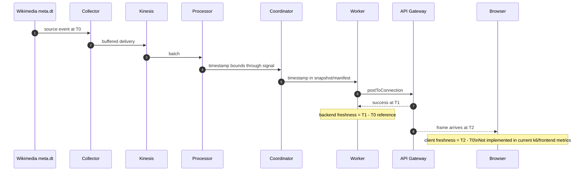
```mermaid
sequenceDiagram
  autonumber
  participant WM as Wikimedia meta.dt
  participant COL as Collector
  participant KDS as Kinesis
  participant RTP as Processor
  participant CO as Coordinator
  participant WK as Worker
  participant AGW as API Gateway
  participant UI as Browser

  WM->>COL: source event at T0
  COL->>KDS: buffered delivery
  KDS->>RTP: batch
  RTP->>CO: timestamp bounds through signal
  CO->>WK: timestamp in snapshot/manifest
  WK->>AGW: postToConnection
  AGW-->>WK: success at T1
  Note over WK: backend freshness = T1 - T0 reference
  AGW-->>UI: frame arrives at T2
  Note over UI: client freshness = T2 - T0\nNot implemented in current k6/frontend metrics
```
